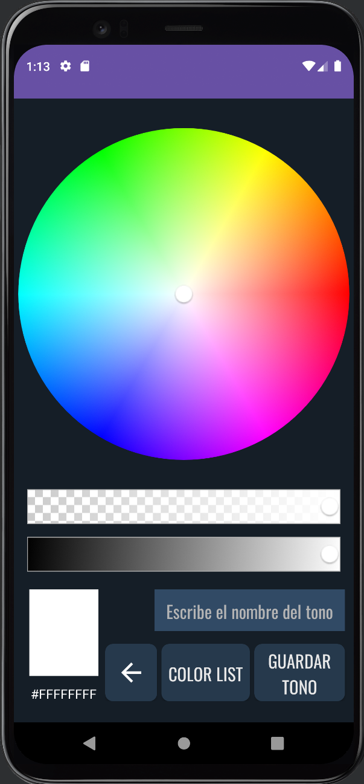
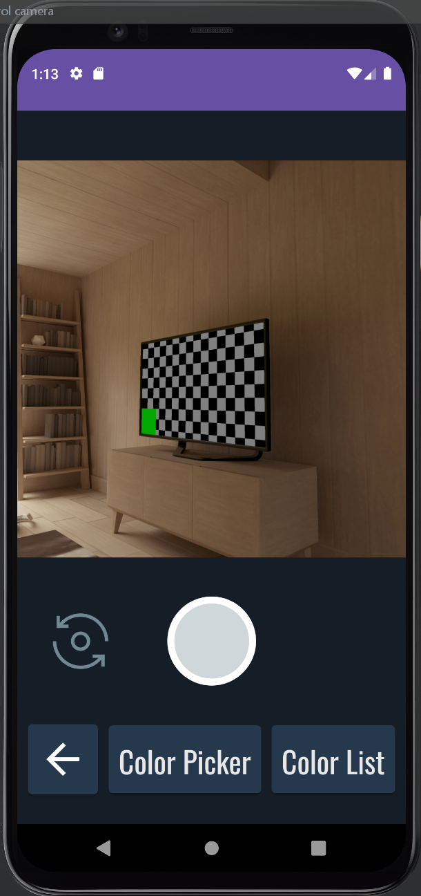
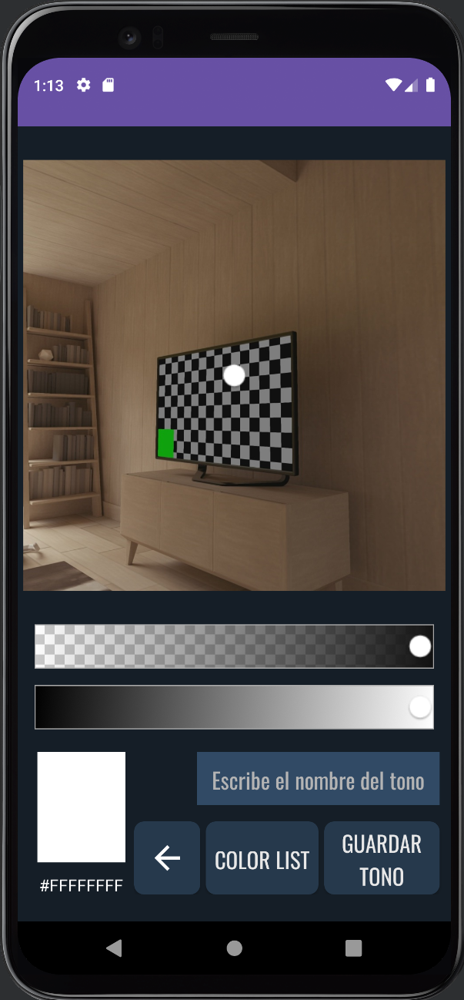
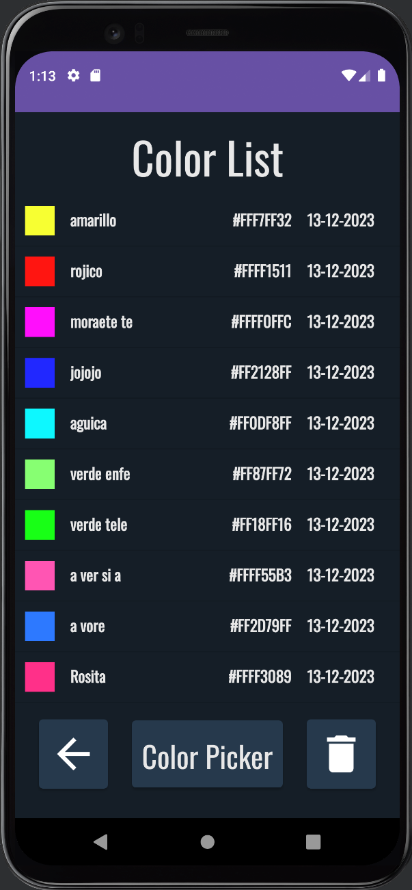
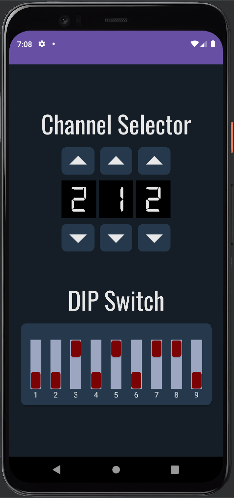

# LIGHT TECH TOOLS

Application consisting of four useful tools for stage lighting technicians:

- Color Picker
- Camera
- Color List
- DMX Selector

## Color Picker

The libreary used is taken directly from the repository of <a href="https://github.com/skydoves/colorpicker-compose">SkyDoves</a>. In addition, I have added action buttons and links to the other related tools of the application.

Once the desired shade is selected, it can be saved by giving it a name at the bottom of the screen and pressing the "save" button.

## Camera

The camera allows taking photos to later select a color from it.

## Color List

The color list allows you to view the stored colors, their names, hexadecimal codes, and the date they were saved. Additionally, you can delete them.

## DMX Calculator

Allows selecting a DMX channel in decimal format and returns the positions of the pins on the DIP Switch. It can also be used in reverse, meaning, placing the pins to know which channel corresponds to that configuration.

## Images Galery

  

